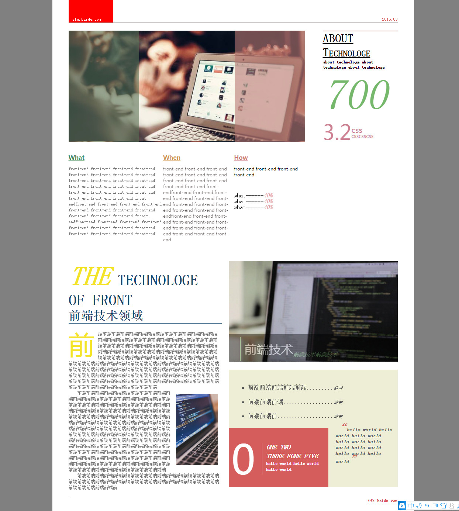

my 2016 baidu ife tasks 
task6.html

task15.html

task23.html 20160422
	这个任务的主要问题在于：还是文本在浏览器中文本节点的问题。同task22.html类似的是，都具有文本节点；但本例中，是实在的文本节点。所以可以通过firstChild和lastChild来获得文本节点。这样就很容易进行查询。另一个问题在于，代码中使用colorChange改变颜色的话，如果没有注意到，即使查询匹配后另外设置的背景颜色，仍然会被colorChange改为white；所以在里面使用了tagColor来监测query是否重新设置了颜色。再者，query的出现应该要在colorchange之后。
